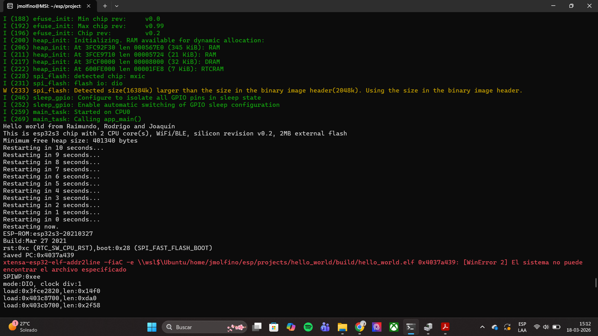

# Ejercicio 1

## Introducción

Este ejercicio es una manera de comenzar familiarizandose con **ESP-IDF** con el clásico ejemplo de hacer un `Hello world!`. La idea es tomar el ejemplo de base que entrega ESP y modificarlo para que imprima nuestros nombres en la consola de depuración.

## Ejecución

Para correr el programa es importante hacerlo en un ESP32-S3 ya que esa fue la placa elegida con el comando `idf.py set-target`. En caso de tener otra placa correr los siguientes comandos:

```bash
idf.py fullclean   # Para quitar todo lo relacionado a algún build anterior
idf.py set-target ${ESP_EN_USO}   # esp32, esp32s3, esp32c3, etc.
```

(En caso de tener el ESP32-S3 no es necesario lo anterior ya que la configuración se encuentra en el archivo `sdkconfig`)

Luego de seleccionar el MCU que se va a usar, hay que compilar y flashear. Para eso usar los comandos:

```bash
idf.py build
idf.py flash ${RUTA-AL-COM}
```

Una vez flasheado, podemos monitorear el MCU y verificar su funcionamiento. Para eso usar el comando:

```bash
idf.py monitor ${RUTA-AL-COM}
```

## Funcionamiento

Una vez se encuentren monitoreando el MCU, se puede ver que el código sigue completamente el flujo del ejemplo, ya que es una copia de este, con la diferencia que al saludar, agrega los nombres de los integrantes del grupo. Se puede ver la salida del monitor en esta imagen:

<p align="center">
  
</p>

Primero se imprime toda la información de la placa, luego se saluda `Hello world from Raimundo, Rodrigo and Joaquin`, imprime un par de lineas más e inicia una cuenta regresiva para reiniciarse.

## Aprendizajes

Este ejercicio es útil para conocer el entorno de **ESP-IDF** haciendo una función básica y un clásico de la programación (`Hello world!`).