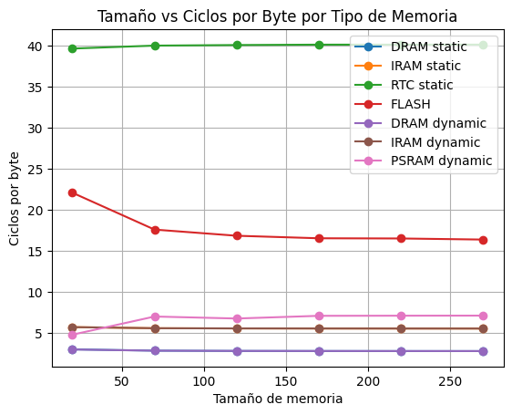

# Ejercicio 1

## Introducción

Este ejercicio busca hacer un _benchmark_ para medir las velocidades de lectura a las distintas memorias que tiene un ESP32.

## Ejecución

Para correr el programa es importante hacerlo en un ESP32-S3 ya que esa fue la placa elegida con el comando `idf.py set-target`. En caso de tener otra placa correr los siguientes comandos:

```bash
idf.py fullclean   # Para quitar todo lo relacionado a algún build anterior
idf.py set-target ${ESP_EN_USO}   # esp32, esp32s3, esp32c3, etc.
```

(En caso de tener el ESP32-S3 no es necesario lo anterior ya que la configuración se encuentra en el archivo `sdkconfig`)

Antes de seguir con la compilación, es necesario verificar que la placa que se va a usar tenga un módulo de **PSRAM** y saber de qué tipo es. El código y el `sdkconfig` se hicieron pensados en el ESP32-S3 N16R8, que cuenta con PSRAM de tipo **octal**. En caso de usar una placa con PSRAM tipo **quad** se deben hacer los siguientes comandos:

```bash
idf.py menuconfig
# Component config -> ESP PSRAM -> SPI RAM config ->
# Mode (QUAD/OCT) of SPI RAM chip in use (Octal Mode PSRAM) ->
# Marcar (X) Quad Mode PSRAM
```

Y en caso de que directamente no tenga PSRAM, habría que desactivarla en `menuconfig` y comentar las lineas relacionadas a la PSRAM del código de [`Ejercicio_4.c`](./main/Ejercicio_4.c).

Luego de seleccionar el MCU que se va a usar, hay que compilar y flashear. Para eso usar los comandos:

```bash
idf.py build
idf.py flash ${RUTA-AL-COM}
```

Una vez flasheado, podemos monitorear el MCU y verificar su funcionamiento. Para eso usar el comando:

```bash
idf.py monitor ${RUTA-AL-COM}
```

Por último, para realizar todas las mediciones. Se debe editar el código para los distintos tamaños de vectores que se quieran realizar, y se debe pegar el arreglo que se encuentra en [`lists.txt`](./main/lists.txt) en la variable `vector_flash_ext` de la linea 24 de [`Ejercicio_4.c`](./main/Ejercicio_4.c), junto con el valor de la constante `VECTOR_SIZE`. ~~(No es lo más elegante pero así se hizo)~~

## Funcionamiento

Una vez se encuentren monitoreando el MCU, la consola imprimirá el resultado del _benchmark_ para el tamaño del arreglo escogido en el código. Para realizar distintos tamaños habría que cambiar los valores de la constante `VECTOR_SIZE` y la variable `vector_flash_ext`. Los arreglos en [`lists.txt`](./main/lists.txt) son de tamaño 20, 70, 120, 170, 220 y 270. En caso de querer generar distintos valores, se puede usar el _script_ de Python [`array_generator`](./array_generator.py) del directorio.

Los resultados obtenidos fueron los siguientes:


<details>
  <summary><b>Tabla tamaño 20</b></summary>

| Size | Memory Type     | Cycles | Cycles/Byte | Bytes |
| ---- | --------------- | ------ | ----------- | ----- |
| 20   | DRAM static     | 238    | 2.9750      | 80    |
| 20   | IRAM static     | 455    | 5.6875      | 80    |
| 20   | RTC static      | 3172   | 39.6500     | 80    |
| 20   | FLASH (.rodata) | 1766   | 22.0750     | 80    |
| 20   | DRAM dynamic    | 237    | 2.9625      | 80    |
| 20   | IRAM dynamic    | 455    | 5.6875      | 80    |
| 20   | PSRAM dynamic   | 381    | 4.7625      | 80    |

</details>

<details>
  <summary><b>Tabla tamaño 70</b></summary>

| Size | Memory Type     | Cycles | Cycles/Byte | Bytes |
| ---- | --------------- | ------ | ----------- | ----- |
| 70   | DRAM static     | 789    | 2.8179      | 280   |
| 70   | IRAM static     | 1555   | 5.5536      | 280   |
| 70   | RTC static      | 11203  | 40.0107     | 280   |
| 70   | FLASH (.rodata) | 4922   | 17.5786     | 280   |
| 70   | DRAM dynamic    | 788    | 2.8143      | 280   |
| 70   | IRAM dynamic    | 1555   | 5.5536      | 280   |
| 70   | PSRAM dynamic   | 1954   | 6.9786      | 280   |

</details>

<details>
  <summary><b>Tabla tamaño 120</b></summary>

| Size | Memory Type     | Cycles | Cycles/Byte | Bytes |
| ---- | --------------- | ------ | ----------- | ----- |
| 120  | DRAM static     | 1336   | 2.7833      | 480   |
| 120  | IRAM static     | 2654   | 5.5292      | 480   |
| 120  | RTC static      | 19239  | 40.0812     | 480   |
| 120  | FLASH (.rodata) | 8077   | 16.8271     | 480   |
| 120  | DRAM dynamic    | 1337   | 2.7854      | 480   |
| 120  | IRAM dynamic    | 2654   | 5.5292      | 480   |
| 120  | PSRAM dynamic   | 3233   | 6.7354      | 480   |

</details>

<details>
  <summary><b>Tabla tamaño 170</b></summary>

| Size | Memory Type     | Cycles | Cycles/Byte | Bytes |
| ---- | --------------- | ------ | ----------- | ----- |
| 170  | DRAM static     | 1886   | 2.7735      | 680   |
| 170  | IRAM static     | 3754   | 5.5206      | 680   |
| 170  | RTC static      | 27287  | 40.1279     | 680   |
| 170  | FLASH (.rodata) | 11233  | 16.5191     | 680   |
| 170  | DRAM dynamic    | 1887   | 2.7750      | 680   |
| 170  | IRAM dynamic    | 3754   | 5.5206      | 680   |
| 170  | PSRAM dynamic   | 4804   | 7.0647      | 680   |

</details>

<details>
  <summary><b>Tabla tamaño 220</b></summary>

| Size | Memory Type     | Cycles | Cycles/Byte | Bytes |
| ---- | --------------- | ------ | ----------- | ----- |
| 220  | DRAM static     | 2436   | 2.7682      | 880   |
| 220  | IRAM static     | 4854   | 5.5159      | 880   |
| 220  | RTC static      | 35313  | 40.1284     | 880   |
| 220  | FLASH (.rodata) | 14515  | 16.4943     | 880   |
| 220  | DRAM dynamic    | 2437   | 2.7693      | 880   |
| 220  | IRAM dynamic    | 4854   | 5.5159      | 880   |
| 220  | PSRAM dynamic   | 6230   | 7.0795      | 880   |

</details>

<details>
  <summary><b>Tabla tamaño 270</b></summary>

| Size | Memory Type     | Cycles | Cycles/Byte | Bytes |
| ---- | --------------- | ------ | ----------- | ----- |
| 270  | DRAM static     | 2986   | 2.7648      | 1080  |
| 270  | IRAM static     | 5954   | 5.5130      | 1080  |
| 270  | RTC static      | 43341  | 40.1306     | 1080  |
| 270  | FLASH (.rodata) | 17671  | 16.3620     | 1080  |
| 270  | DRAM dynamic    | 2987   | 2.7657      | 1080  |
| 270  | IRAM dynamic    | 5954   | 5.5130      | 1080  |
| 270  | PSRAM dynamic   | 7657   | 7.0898      | 1080  |

</details>

Se hizo un gráfico para hacer esta comparación de manera visual usando el [siguiente Colab](https://colab.research.google.com/drive/1nuUW_SDzyqNbHDTMBrFMNAEKJ7bE05tp?usp=sharing) (También disponible en el archivo [`.ipynb`](./SE_L1_E4.ipynb) del directorio) quedando de esta manera:

<p align="center">
  
</p>

## Análisis

Analizando los datos viendo las tablas y el gráfico, podemos notar que las memorias DRAM, IRAM y PSRAM son significativamente más rápidas de acceder que la memoria FLASH y la RTC, cosa que tiene bastante sentido ya que la FLASH está pensada para tener el firmware, constantes o configuraciones persistentes y no para realizar cálculos con los datos de ella, como pasa con las memorias mas rápidas. Por otro lado la RTC también hace sentido su velocidad, al ser una memoria pensada para usar cuando el dispositivo está en **`Sleep Mode`** por lo que se prioriza el bajo consumo sobre la velocidad.

Con respecto a las memorias más rápidas, la DRAM destaca sobre las demás al ser la memoria principal usada por defecto por el código, pensada en tener acceso directo y baja latencia. Tiene que ser rápida para poder realizar los cálculos de manera eficáz.

Con respecto a la IRAM y la PSRAM, no sabíamos muy bien en un principio cual debía ser la más rápida, ya que la PSRAM está pensada usarse como una extensión de la DRAM por lo que debería ser rápida pero al ser un módulo aparte es probable que tenga latencia. Por otro lado, la IRAM también debe ser rápida ya que esta almacena las instrucciones críticas que el MCU debe realizar con acceso rápido, por lo que debe ser suficientemente rápida para no tener un cuello de botella que cuelgue la CPU al no saber que instrucción realizar. Por lo que se pudo ver en el gráfico, la IRAM fue algo más rápida, aunque por muy poco (incluso en tamaños pequeños fue al revés), por lo que se puede explicar por esta latencia añadida al estar en un módulo aparte.

Por último, aunque en el gráfico no se vea bien, las diferencias entre las memorias estáticas y dinámicas no fueron considerables, mostrando que la velocidad depende más de la arquitectura de la memoria más que del tipo de esta.

## Aprendizajes

Este ejercicio sirvió para entender el uso de `menuconfig`, al tener que activar la PSRAM, desactivar la seguridad de la memoria para poder escribir sobre la IRAM y conocer las diferencias que hay entre distintas placas.

También sirvió para entender cómo se manejan las memorias del MCU desde el código, y ver lo importante que es optimizar el uso de estas al haber tanta diferencia de velocidad de lectura entre los distintos tipos.