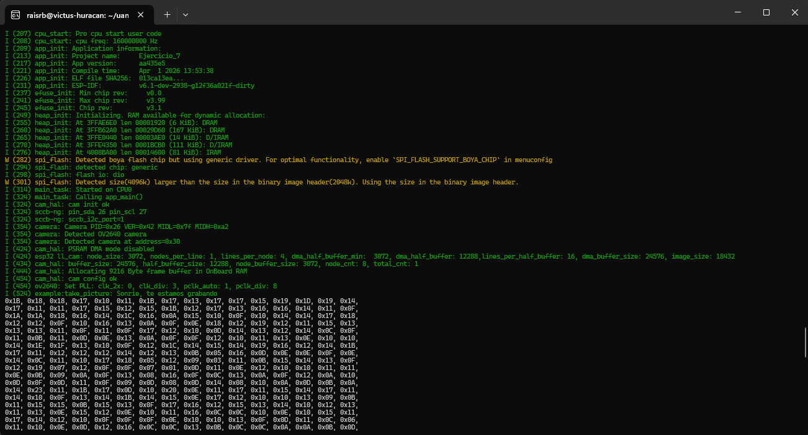
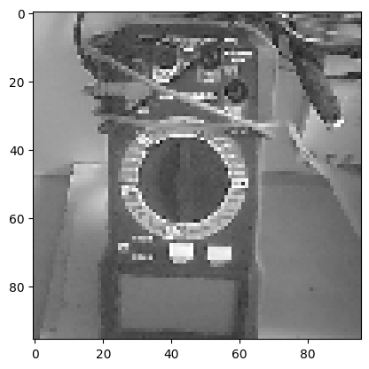
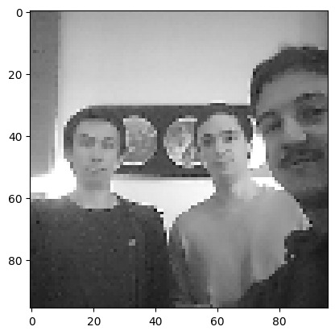

# Ejercicio 7

[Ejercicio 6](../Ejercicio_6/README.md) - [Volver](../README.md) - [Ejercicio 8](../Ejercicio_8/README.md)

## Introducción

Este ejercicio busca implementar el ejemplo que trae **ESP-IDF** para usar la cámara del **ESP-CAM**, haciendo ligeras modificaciones para entender mejor el código y que imprima la foto en Hex para luego pasarlo por un código en Python y mostrar la imagen reconstruída. 

## Ejecución

Para correr el programa es importante hacerlo en un ESP32 ya que esa fue la placa elegida con el comando `idf.py set-target` y es la placa del ESP-CAM usado en el laboratorio. Luego hay que compilar y flashear. Para eso usar los comandos:

```bash
idf.py build
idf.py flash ${RUTA-AL-COM}
```

Una vez flasheado, podemos monitorear el MCU y verificar su funcionamiento. Para eso usar el comando:

```bash
idf.py monitor ${RUTA-AL-COM}
```

## Funcionamiento

El código es, básicamente, la implementación base del ejemplo que entrega ESP-IDF para usar el ESP-CAM. Para esto se tuvo que configurar el MCU que en nuestro caso es la `BOARD_ESP32CAM_AITHINKER`. Luego se editó ligeramente el código para 2 cosas. En primer lugar el código está imprimiendo el clásico mensaje de los lugares con cámaras de vigilancia que dice `"Sonrie, te estamos grabando"`, y después se hizo que el código imprimiera en consola los valores hexadecimales de cada pixel de la foto (se hizo que saltara la linea cada 24 pixeles). Por lo tanto, un output esperado sería el siguiente:

<p align="center">
  
</p>

*(El output no está completo para no mostrar todos los pixeles)

Para poder ver la imágen, hay que copiar los valores entregados en el código y pegarlos en el notebook entregado por el profesor en el enunciado, que también está en [este archivo `.ipynb`](./SE_L1_E7.ipynb) (o [este Colab](https://colab.research.google.com/drive/1mn2NfLpON0XtHSGP5-V0_uuWvwm65_hk?usp=sharing)). Una vez cambiando los valores y ejecutando el notebook, podemos ver la foto. Aquí hay unos ejemplos de un multímetro y del grupo capturados con el ESP-CAM:

<p align="center">
  
</p>

<p align="center">
  
</p>

## Aprendizajes

Este ejercicio muestra que el trabajar con imágenes imprimiendo los píxeles puede ser lento y que es importante aumentar el tiempo del watchdog para que no se cuelgue.
