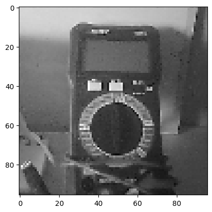
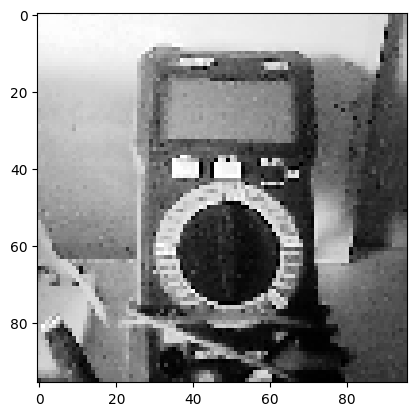
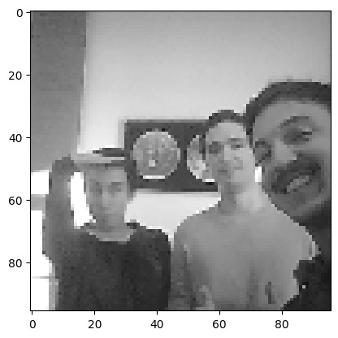
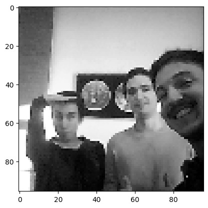
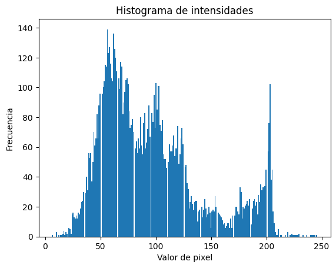
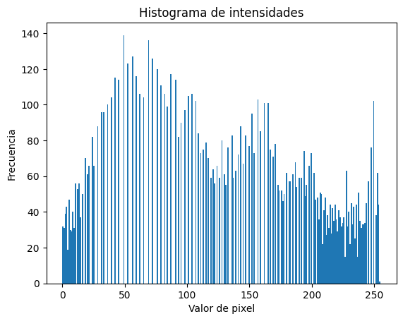
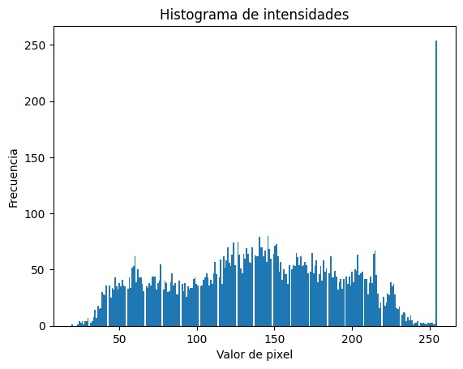
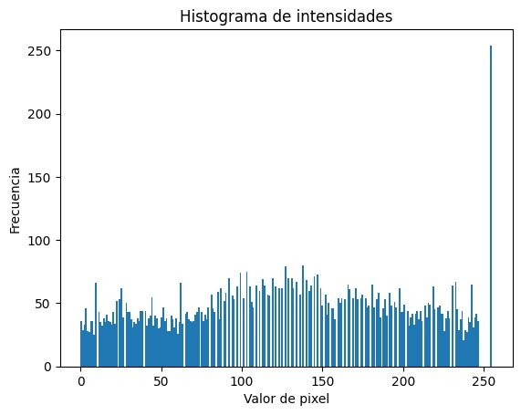

# Ejercicio 7

[Ejercicio 6](../Ejercicio_6/README.md) - [Volver](../README.md)

## Introducción

Este ejercicio busca enseñar para qué sirve aplicar una ecualización de histograma a una imagen con baja resolución. 

## Ejecución

Para correr el programa es importante hacerlo en un ESP32 ya que esa fue la placa elegida con el comando `idf.py set-target` y es la placa del ESP-CAM usado en el laboratorio. Luego hay que compilar y flashear. Para eso usar los comandos:

```bash
idf.py build
idf.py flash ${RUTA-AL-COM}
```

Una vez flasheado, podemos monitorear el MCU y verificar su funcionamiento. Para eso usar el comando:

```bash
idf.py monitor ${RUTA-AL-COM}
```

## Funcionamiento

El código es, básicamente, la implementación del [Ejercicio_7](../Ejercicio_7/). Luego se editó ligeramente el código, agregando la función `histogram_equalization` que aplica la ecualización de histograma, por lo que se toma una imágen, se imprime, luego se aplica la ecualización y se vuelve a imprimir.

La función `histogram_equalization` hace lo siguiente:

- Recorre cada pixel, contando cuántas veces aparece cada valor de intensidad.
- Calcula la función de distribución acumulada para cada valor.
- Busca el primer valor no nulo (para evitar un error al ser una función acumulada).
- Aplica la normalización/ecualización.

Para poder ver las imagenes, hay que copiar los valores entregados en el código y pegarlos en el notebook que está en [este archivo `.ipynb`](./SE_L1_E8.ipynb) (o [este Colab](https://colab.research.google.com/drive/1DVBo-bludD95TED5lf7KmqXGEHkcwxAT?usp=sharing)). Una vez cambiando los valores y ejecutando el notebook, podemos ver la foto. Aquí hay un ejemplos de un multímetro y del grupo capturados con el ESP-CAM antes y después de aplicar la equalización de histograma:

<p align="center">
  
  
</p>

<p align="center">
  
  
</p>

Además podemos ver los histogramas en los siguientes gráficos para ver cómo cambia entre el original y el ecualizado, para ver cómo se normaliza todo:

<p align="center">
  
  
</p>

<p align="center">
  
  
</p>

## Aprendizajes

Este ejercicio muestra cómo obtener más información de una imágen de poca calidad usando la ecualización de histograma para aumentar el contraste.
