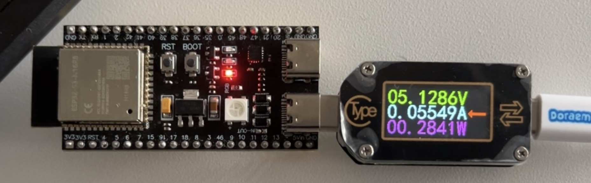
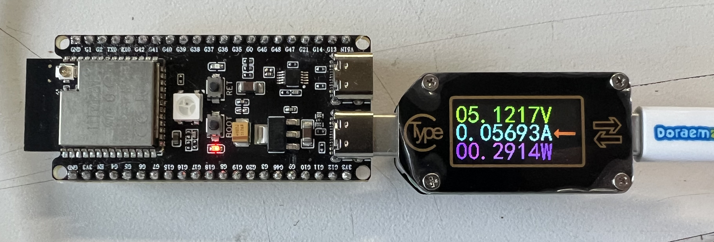

# Ejercicio 1

[Volver](../README.md) - [Ejercicio 2](../Ejercicio_2/README.md)

- [Ejercicio 1.1](#implementación-directa-en-c-ejercicio-11)

## Introducción

Este ejercicio es para ver el consumo de TinyML en los _end devices_, para lo que se usará el ejemplo de **Tensorflow Lite Micro** que infiere la función seno.

## Consideraciones

Aunque se espera usar el ML en el **ESP32-CAM**, debido a limitaciones técnicas por las herramientas en nuestra disposición, se medirá el consumo en el **ESP-S3**, por lo que se espera que el real sea algo menor para la potencia aunque algo más lento en tiempo.

## Resultados

### Ejemplo [Hello World](./hello_world/)

Al medir la potencia del MCU con el ejemplo de HelloWorld, los resultados fueron los siguientes:



$V = 5.1287 V \pm 0.0001 V$

$I = 0.05552 A \pm 0.00002 A$

$P = 0.2842 W \pm 0.0001 W$

Con respecto a los resultados y tiempos de inferencia, esto fue lo que entregaba el monitor:

```c
x=0.000000 y=0.000000 time=135 us
x=0.314159 y=0.372770 time=61 us
x=0.628319 y=0.559154 time=58 us
x=0.942478 y=0.838731 time=53 us
x=1.256637 y=0.965812 time=57 us
x=1.570796 y=1.042060 time=53 us
x=1.884956 y=0.957340 time=59 us
x=2.199115 y=0.821787 time=52 us
x=2.513274 y=0.533738 time=58 us
x=2.827433 y=0.237217 time=53 us
x=3.141593 y=0.008472 time=57 us
x=3.455752 y=-0.304993 time=53 us
x=3.769912 y=-0.533738 time=59 us
x=4.084070 y=-0.779427 time=52 us
x=4.398230 y=-0.965812 time=58 us
x=4.712389 y=-1.109837 time=53 us
x=5.026548 y=-0.982756 time=57 us
x=5.340708 y=-0.745539 time=53 us
x=5.654867 y=-0.533738 time=59 us
x=5.969026 y=-0.355825 time=52 us
```

La primera inferencia tiene un tiempo considerablemente más alto, que es por el _overhead_ del MCU, luego en las siguientes se puede ver un tiempo de inferencia promedio de $56 \mu s$ aproximadamente.

### [Implementación directa](./direct_implementation/) en C (`Ejercicio 1.1`)

Sobre la implementación directa, para que las mediciones fueran algo más parecidas y comparables, se agregó el `VTaskDelay()` que tiene el ejemplo `hello_world` en cada inferencia, dando un tiempo de $500 ms$ entre cada una. Los resultados de potencia obtenidos fueron:



$V = 5.1217 V \pm 0.0002 V$

$I = 0.05693 A \pm 0.00008 A$

$P = 0.2914 W \pm 0.0003 W$

Con respecto a los resultados y tiempos de inferencia, esto fue lo que entregaba el monitor:

```c
x=0.000000 y=0.026406 time=113 us
x=0.200000 y=0.191269 time=18 us
x=0.400000 y=0.366415 time=18 us
x=0.600000 y=0.541561 time=18 us
x=0.800000 y=0.710643 time=18 us
x=1.000000 y=0.863043 time=17 us
x=1.200000 y=0.922222 time=17 us
x=1.400000 y=0.961839 time=18 us
x=1.600000 y=1.001457 time=18 us
x=1.800000 y=0.964348 time=18 us
x=2.000000 y=0.887233 time=17 us
x=2.200000 y=0.810119 time=17 us
x=2.400000 y=0.689675 time=17 us
x=2.600000 y=0.502332 time=18 us
x=2.799999 y=0.314990 time=18 us
x=2.999999 y=0.127647 time=18 us
x=3.199999 y=-0.059696 time=17 us
x=3.399999 y=-0.247038 time=18 us
x=3.599999 y=-0.434381 time=18 us
x=3.799999 y=-0.603903 time=18 us
x=3.999998 y=-0.769162 time=17 us
x=4.199998 y=-0.910219 time=17 us
x=4.399998 y=-0.947471 time=18 us
x=4.599998 y=-0.984722 time=18 us
x=4.799998 y=-1.005163 time=17 us
x=4.999998 y=-0.956519 time=17 us
x=5.199997 y=-0.898885 time=17 us
x=5.399997 y=-0.771508 time=18 us
x=5.599997 y=-0.620430 time=18 us
x=5.799997 y=-0.450327 time=17 us
x=5.999997 y=-0.280225 time=17 us
```

Nuevamente, la primera inferencia es mayor a las demás debido al _overhead_. Sin considerar esa, en esta implementación el tiempo de inferencia ronda los $17.5 \mu s$ aproximadamente

## Análisis

Viendo los resultados podemos sacar las siguientes conclusiones:

### Potencia

Viendo los resultados, se pudo notar un pequeño aumento en el consumo en la implementación directa. Esto se puede deber a que el tiempo de inferencia es menor, usando la librería DSP que podría usar otras partes del procesador haciendo que necesite más energía.

### Tiempo

Con respecto al tiempo, se puede ver una mejora significativa, siendo cerca de 3 veces más rápida la implementación directa. Esto puede deberse a que TF Lite Micro para tener mayor compatibilidad ignora algunas funciones específicas de DSP, mientras que la implementación directa aprovecha el hardware completamente.

### Resultados

Si bien los resultados obtenidos de inferencia se esperaba que fueran iguales, las diferencias que hay pueden deberse a realizar operaciones con decimales pequeños que algunos compiladores pueden aproximar de manera distinta o que las operaciones de DSP hacen aproximaciones para optimizar la ejecución.
