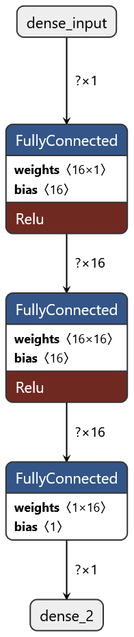

# Modelo base

<!--> Esto es lo que saqué de Netrón, es más que nada para tenerlo escrito para pasarlo a direct implementation <-->

## Visualización en Netron

## Representación numérica

### Dense Input

### Fully Connected (1x16)

#### Pesos

1. -0.12180936336517334
2. -0.3929499089717865
3. 0.1962481290102005
4. 0.6956225633621216
5. 0.14335781335830688
6. -0.06439566612243652
7. -0.18021363019943237
8. -0.054397642612457275
9. -0.4619080424308777
10. 0.4055696427822113
11. 0.27962690591812134
12. -0.5141448378562927
13. -0.42096662521362305
14. 0.6256062984466553
15. -0.37430816888809204
16. -0.33132314682006836

#### Sesgos

1. 0
2. 0
3. 0.3786514103412628
4. -0.7221674919128418
5. 0.09094736725091934
6. 0.8576537370681763
7. 0
8. 0
9. 0
10. 1.1846195459365845
11. -0.20879396796226501
12. 0
13. 0
14. -0.011825152672827244
15. 0
16. 0

#### ReLU

- ReLU

### Fully Connected (16x16)

#### Pesos

1. Primera Neurona
    - 0.0027225911617279053
    - 0.18983474373817444
    - 0.41336789727211
    - -0.18240013718605042
    - 0.2007804811000824
    - -0.19718044996261597
    - -0.06138917803764343
    - -0.12958911061286926
    - -0.12484398484230042
    - -0.4296090304851532
    - -0.3490271270275116
    - 0.3468421995639801
    - 0.3684578835964203
    - 0.18269559741020203
    - 0.23875799775123596
    - -0.2323986440896988

2. Segunda Neurona
    - -0.025780469179153442
    - 0.19623693823814392
    - 0.03369263559579849
    - -0.6074578166007996
    - 0.07136324793100357
    - 0.401083379983902
    - -0.39895179867744446
    - -0.12483623623847961
    - -0.3789287507534027
    - 0.2639991343021393
    - -0.3698916733264923
    - 0.34108874201774597
    - -0.26812106370925903
    - 0.16135936975479126
    - -0.1342160403728485
    - 0.36499324440956116

3. Tercera Neurona
    - 0.14257463812828064
    - -0.18008947372436523
    - 0.35641762614250183
    - -0.5778324604034424
    - -0.393827348947525
    - 0.8056795001029968
    - -0.263570100069046
    - -0.01627323031425476
    - 0.3025842607021332
    - 0.4566139876842499
    - 0.21970704197883606
    - -0.21923679113388062
    - 0.15798768401145935
    - -0.5030084848403931
    - 0.33370068669319153
    - -0.14506402611732483

4. Cuarta Neurona
    - -0.2073986679315567
    - -0.35889649391174316
    - 0.1797211617231369
    - 0.4593379497528076
    - 0.20270542800426483
    - -0.39704400300979614
    - 0.3732830584049225
    - -0.3063697814941406
    - 0.3175797164440155
    - -0.1850675493478775
    - 0.2977258861064911
    - -0.2707940936088562
    - -0.2222711741924286
    - -0.1752738207578659
    - -0.23541268706321716
    - -0.03539720177650452

5. Quinta Neurona
    - 0.07093545794487
    - -0.2856180667877197
    - -0.1195007860660553
    - 0.37393417954444885
    - -0.032085925340652466
    - -0.42951568961143494
    - 0.3786592185497284
    - 0.06391224265098572
    - 0.10423329472541809
    - -0.007706940174102783
    - 0.14500054717063904
    - 0.039341628551483154
    - 0.03364381194114685
    - -0.3499203324317932
    - -0.13348707556724548
    - -0.3816155195236206

6. Sexta Neurona
    - 0.003396540880203247
    - 0.11320623755455017
    - 0.02002820558845997
    - 0.11572672426700592
    - -0.005094918888062239
    - 0.42318350076675415
    - -0.0019834041595458984
    - 0.27106973528862
    - -0.07390880584716797
    - -0.18350361287593842
    - -0.09491398930549622
    - -0.060689955949783325
    - 0.23715534806251526
    - 0.2811555862426758
    - -0.04390755295753479
    - 0.14753779768943787

7. Septima Neurona
    - -0.3940480947494507
    - -0.29011958837509155
    - -0.02212396264076233
    - 0.255339115858078
    - -0.3506515622138977
    - -0.4268346130847931
    - 0.2926781475543976
    - 0.04957926273345947
    - 0.25725534558296204
    - -0.3673473596572876
    - 0.09449979662895203
    - 0.3963540494441986
    - -0.3343580961227417
    - -0.07587239146232605
    - -0.342684268951416
    - 0.4181382358074188

8. Octava Neurona
    - -0.022124379873275757
    - 0.0018830597400665283
    - 0.12194328010082245
    - 0.5240871906280518
    - -0.39801761507987976
    - -0.43094855546951294
    - -0.3179985582828522
    - -0.24505843222141266
    - -0.20615866780281067
    - -0.23297451436519623
    - 0.37499183416366577
    - 0.01292884349822998
    - 0.012023955583572388
    - -0.20294255018234253
    - -0.10908496379852295
    - 0.13056108355522156

9. Novena Neurona
    - 0.11879357695579529
    - 0.20404520630836487
    - -0.16572046279907227
    - 0.1449335813522339
    - 0.12137463688850403
    - 0.07978656888008118
    - -0.29415494203567505
    - -0.09883362054824829
    - 0.08394333720207214
    - 0.2731185555458069
    - -0.04877723380923271
    - -0.40059465169906616
    - 0.4029903709888458
    - 0.3822925090789795
    - -0.42965972423553467
    - 0.01964583992958069

10. Decima Neurona
    - 0.02541375160217285
    - -0.3499251902103424
    - -0.02137753553688526
    - 0.4022998809814453
    - -0.19355754554271698
    - -0.45235371589660645
    - -0.30786943435668945
    - 0.19118043780326843
    - -0.21551164984703064
    - -0.5623782277107239
    - 0.40723878145217896
    - 0.006060183048248291
    - -0.21781985461711884
    - 0.37455931305885315
    - -0.062002331018447876
    - -0.27808982133865356

11. Decimaprimer Neurona
    - 0.028215527534484863
    - 0.25770387053489685
    - 0.18670712411403656
    - -0.4259430468082428
    - -0.005115911364555359
    - 0.8945462703704834
    - 0.3702852427959442
    - 0.2569825351238251
    - 0.04572060704231262
    - -0.02441404201090336
    - -0.06804883480072021
    - 0.2841321527957916
    - -0.14558589458465576
    - -0.6402272582054138
    - 0.3264928162097931
    - 0.4267444908618927

12. Decimasegunda Neurona
    - -0.24531064927577972
    - 0.3835720121860504
    - 0.16226670145988464
    - -0.11394450068473816
    - 0.053048670291900635
    - -0.015474289655685425
    - 0.33776620030403137
    - -0.03666755557060242
    - -0.06950125098228455
    - -0.3659064769744873
    - -0.08370888233184814
    - 0.25855931639671326
    - 0.057923585176467896
    - 0.4006575047969818
    - 0.007971644401550293
    - -0.3471950590610504

13. Decimatercer Neurona
    - -0.3998015522956848
    - -0.22428658604621887
    - 0.2061450332403183
    - -0.13268886506557465
    - 0.2491515874862671
    - 0.8166562914848328
    - 0.12804529070854187
    - -0.30007338523864746
    - -0.15637004375457764
    - 0.47431984543800354
    - -0.19108781218528748
    - 0.33162859082221985
    - 0.05137836933135986
    - -0.3956833481788635
    - -0.10591194033622742
    - 0.34808632731437683

14. Decimocuarta Neurona
    - 0.36735162138938904
    - 0.3183262050151825
    - -0.24144241213798523
    - -0.2489166259765625
    - -0.24684159457683563
    - 0.7941295504570007
    - 0.4072605073451996
    - 0.013025254011154175
    - -0.32647430896759033
    - -0.11593519896268845
    - 0.5575068593025208
    - 0.01566949486732483
    - 0.1340005099773407
    - -0.6853724122047424
    - 0.08650955557823181
    - 0.2571868598461151

15. Decimoquitna Neurona
    - -0.09131631255149841
    - -0.08977609872817993
    - -0.15830881893634796
    - 0.2629053592681885
    - 0.18760274350643158
    - -0.4070013165473938
    - 0.11684796214103699
    - -0.429512619972229
    - -0.268528014421463
    - 0.24691413342952728
    - -0.14726854860782623
    - 0.26559004187583923
    - -0.28075987100601196
    - 0.25861656665802
    - -0.41818663477897644
    - -0.08954474329948425

16. Decimosexta Neurona
    - 0.21914830803871155
    - 0.2879165709018707
    - -0.26394495368003845
    - -0.32984206080436707
    - 0.1691901683807373
    - 0.042184554040431976
    - -0.20519524812698364
    - -0.3780844509601593
    - -0.004826903343200684
    - 0.33323872089385986
    - 0.30983003973960876
    - -0.1788569986820221
    - -0.1724168062210083
    - 0.057067230343818665
    - -0.31484460830688477
    - -0.3968038260936737

#### Sesgos

1. 0
2. 0.5027430653572083
3. 0.4076739549636841
4. -0.2554803490638733
5. 0
6. 0.1749088615179062
7. 0
8. -0.24164630472660065
9. 0.07021674513816833
10. -0.43093863129615784
11. 0.597221851348877
12. 0
13. 0.2202627807855606
14. 0.5447701215744019
15. -0.19466280937194824
16. -0.07130637764930725

#### ReLU

- ReLU

### Fully Connected (16x1)

#### Pesos

1. -0.47172480821609497
2. 1.2040079832077026
3. 1.2589000463485718
4. 0.358551561832428
5. 0.11061286926269531
6. -0.2626565396785736
7. 0.33092570304870605
8. 0.8805835247039795
9. -0.18485286831855774
10. 1.0813982486724854
11. -0.7373619675636292
12. 0.31201863288879395
13. -0.850340723991394
14. -0.9309349656105042
15. 0.13627851009368896
16. 0.11121345311403275

#### Sesgo

1. -0.16013234853744507

### Dense Output