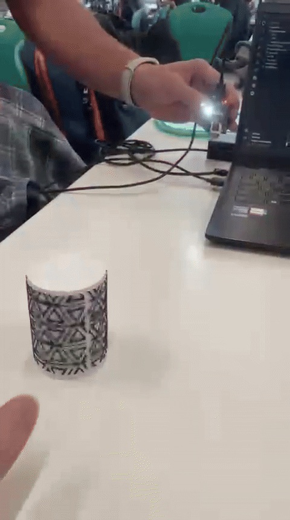

# Ejercicio 3

[Ejercicio 2](../Ejercicio_2/README.md) - [Volver](../README.md) - [Ejercicio 3](../Ejercicio_4/README.md)

## Introducción

Este ejercicio tuvo el objetivo de integrar un modelo de TinyML usado para detectar el identificador de los robots en la cámara ESP32 CAM.

Para el desarrollo de este ejercicio se probaron diversos modelos, probando aquellos también realizados para el Laboratorio 2. Se decidió utilizar el modelo 
curriculum_int8.tflite ubicado en la carpeta test_curriculum con su código correspondiente. Este es el modelo usado en el video disponible en el link de output.pdf.

Para el desarrollo del proyecto se espera desarrollar y mejorar este mismo modelo haciéndolo más simple en términos de que no necesariamente detecte la ubicación de los identificadores pero sí que sea capaz de detectarlos de manera muy precisa. 

## Modelos

Para esta entrega se entrenaron nuevos modelos y se probaron algunos de la entrega pasada. Los nuevos modelos entrenados fueron los 3 siguientes:

- [`curriculum_int8.tflite`](./test_curriculum/main/curriculum_int8.tflite): Este es un modelo que aprendió usando el método de **Curriculum Learning** (Aprender comenzando por lo fácil hasta pasar a lo dificil).
- [`student_int8.tflite`](./test_kd/main/student_int8.tflite): Este es un modelo _student_ que aprendió desde un modelo _teacher_ más pesado. Se esperaban buenos resultados al ser un problema donde las _soft classes_ tienen alta relacion (Izquierda es muy probable que sea más cercano a Centro que Derecha). Sin embargo, esto tiene mejores resultados cuando el _teacher_ es muy preciso, cosa que no fue así en nuestro caso.
- [`simple_int8.tflite`](./test_simple/main/simple_int8.tflite): Otro modelo de convoluciones con lo último visto en el curso.

El entrenamiento de estos modelos se encuentra en el directorio [Extra 1](../Extra_1/), se entrenaron nuevos modelos porque se hizo un dataset nuevo, que se creó usando el código del directorio [Extra 2](../Extra_2/).

Además se probó, en [Test Other](./test_other/) modelos de la entrega anterior para probarlos.

## Resultados

Con respecto a los modelos de la entrega pasada, no se obtuvieron resultados tan buenos, sobre todo con respecto al peso y tiempo de ellos, siendo muy pesados para el ESP32 y muy lentos para ser usados en una tarea real. Con respecto a los nuevos modelos, el que dió mejores resultados fue el que aprendió por Curriculum, muy seguido del Simlpe, mientras que el Student no fue tan bueno en la tarea. Con respecto al modelo, tenía algo de retraso pero fue capaz de identificar correctamente la mayoría de las veces si estaba (o no) el ID y en que parte de la imágen:

